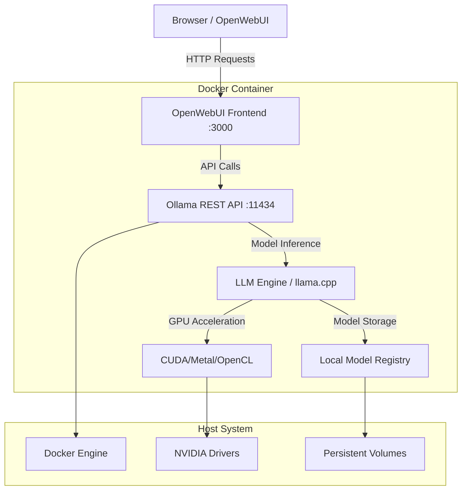

# Build Your Own Chatbot with Docker, Ollama and OpenWebUI

> Zero setup. Run LLMs locally with a browser UI. CPU or GPU. No environment chaos.

---

## 🧠 Core Idea: Local LLMs Should Be Easy

If you're experimenting with LLMs, building prototypes, or running private workloads, installing model runtimes locally can get messy fast. Different libraries, conflicting versions, dependencies that explode your OS — we’ve all been there.

This project solves that pain.

We package **Ollama (LLM runtime)** + **OpenWebUI (browser-based interface)** into a single Docker image.

You don’t install anything except Docker.

When the container runs:

* Ollama starts in the background (serving models via REST API at port `11434`)
* OpenWebUI launches a clean chat interface at `http://localhost:3000`

---

### What is Ollama?

**Ollama** is a lightweight, extensible framework for building and running large language models (LLMs) locally. Think of it as the "Docker for AI models" - it makes running sophisticated language models as simple as pulling and running a container.

**Key Features:**
- **Local Execution**: Run models entirely on your machine without internet dependency
- **Multi-Model Support**: Supports LLaMA, Mistral, Phi, CodeLlama, and many other popular models
- **Efficient Resource Management**: Optimized for both CPU and GPU execution
- **REST API**: Provides a clean HTTP API for model interactions
- **Model Quantization**: Automatically handles model optimization for different hardware

**How Ollama Works:**
1. **Model Storage**: Models are stored in a local registry (similar to Docker images)
2. **Runtime Engine**: Provides an optimized inference engine built on llama.cpp
3. **API Server**: Exposes models through RESTful endpoints
4. **Resource Management**: Automatically manages GPU memory and CPU threading

### What is OpenWebUI?

**OpenWebUI** (formerly Ollama WebUI) is a feature-rich, self-hosted web interface designed to operate entirely offline with Ollama. It provides a ChatGPT-like experience for local language models.

**Key Features:**
- **Intuitive Interface**: Clean, modern chat interface similar to ChatGPT
- **Multi-Model Support**: Switch between different models in the same conversation
- **Conversation Management**: Save, organize, and search through chat history
- **User Management**: Multi-user support with authentication
- **Customizable**: Themes, settings, and model parameters
- **Import/Export**: Backup and restore conversations and settings
- **Real-time Streaming**: Live response streaming for better user experience

**Architecture Benefits:**
- **Privacy First**: All data stays on your machine
- **Offline Capable**: Works without internet connection
- **Extensible**: Plugin system for additional functionality
- **Cross-Platform**: Runs anywhere Docker is supported

### Understanding Language Models

**Large Language Models (LLMs)** are neural networks trained on vast amounts of text data to understand and generate human-like text. Popular models include:

- **LLaMA (Large Language Model Meta AI)**: Meta's efficient language model family
- **Mistral**: High-performance models optimized for efficiency
- **Phi**: Microsoft's small language models with strong reasoning capabilities
- **CodeLlama**: Specialized for code generation and programming tasks
- **Qwen**: Alibaba's multilingual language model series

**Model Sizes and Performance:**
- **1.5B-7B parameters**: Fast inference, good for simple tasks, lower resource usage
- **8B-13B parameters**: Balanced performance and resource usage
- **30B+ parameters**: High-quality responses, requires more powerful hardware

---

## 🧱 Architecture Overview



### Component Breakdown

**OpenWebUI Frontend (Port 3000)**
- React-based web application
- Handles user authentication and session management
- Provides chat interface and conversation history
- Manages UI state and real-time streaming

**Ollama REST API (Port 11434)**
- HTTP server built on Go
- Handles model lifecycle (pull, load, unload)
- Provides endpoints for text generation and embedding
- Manages concurrent requests and resource allocation

**LLM Inference Engine**
- Built on llama.cpp for optimal performance
- Supports CPU (AVX2, AVX-512) and GPU acceleration
- Handles model quantization and memory management
- Implements efficient attention mechanisms and KV-cache

**Hardware Acceleration**
- **CUDA**: NVIDIA GPU acceleration (RTX, A100, etc.)
- **Metal**: Apple Silicon GPU acceleration (M1, M2, M3)
- **OpenCL**: Cross-platform GPU acceleration
- **CPU**: Multi-threaded execution with BLAS optimization

**Data Flow:**
1. User sends message through OpenWebUI
2. Frontend makes HTTP request to Ollama API
3. Ollama loads model (if not already loaded)
4. Inference engine processes request with hardware acceleration
5. Response streams back through the chain to user

---

## 🛠 Prerequisites

* Docker installed
* (optional) NVIDIA GPU + NVIDIA container toolkit

Verify NVIDIA toolkit:

```
docker run --rm --gpus all nvidia/cuda:12.2.0-base nvidia-smi
```

If you see GPU details → you're good.

---

## 🧩 Docker Compose Configuration

This project uses `docker-compose.yml` to orchestrate Ollama and OpenWebUI services.

**GPU Support:** The compose file includes a commented-out GPU configuration section for the Ollama service. To enable GPU acceleration, uncomment the `deploy` section in `docker-compose.yml`:

```yaml
deploy:
  resources:
    reservations:
      devices:
        - driver: nvidia
          count: all
          capabilities: [gpu]
```

---

## 🚀 Run the Workspace

### Docker Compose (Local Development)

#### CPU

```bash
docker-compose up -d
```

#### GPU (CUDA)

1. Uncomment the GPU configuration in `docker-compose.yml` (see Docker Compose Configuration section above)
2. Run:

```bash
docker-compose up -d
```

> **Note:** GPU support requires NVIDIA Container Toolkit installed on your host machine.

### OpenShift (Production Deployment)

Deploy to OpenShift/Kubernetes for production workloads with high availability and enterprise features.

#### Prerequisites

- OpenShift cluster access with admin privileges
- `oc` CLI tool installed and configured
- Sufficient cluster resources:
  - **CPU**: 5+ cores available
  - **Memory**: 10+ GB RAM available  
  - **Storage**: 60+ GB persistent storage
- (Optional) **NVIDIA GPU Operator** for GPU acceleration

#### GPU Support Setup

For GPU acceleration on OpenShift, install the NVIDIA GPU Operator:

```bash
# Install NVIDIA GPU Operator via OpenShift Console or CLI
oc apply -f - <<EOF
apiVersion: v1
kind: Namespace
metadata:
  name: nvidia-gpu-operator
---
apiVersion: operators.coreos.com/v1
kind: OperatorGroup
metadata:
  name: nvidia-gpu-operator-group
  namespace: nvidia-gpu-operator
spec:
  targetNamespaces:
  - nvidia-gpu-operator
---
apiVersion: operators.coreos.com/v1alpha1
kind: Subscription
metadata:
  name: gpu-operator-certified
  namespace: nvidia-gpu-operator
spec:
  channel: "stable"
  name: gpu-operator-certified
  source: certified-operators
  sourceNamespace: openshift-marketplace
EOF

# Wait for operator to be ready
oc get csv -n nvidia-gpu-operator

# Enable GPU support in Ollama deployment
# Edit openshift.yaml and uncomment the GPU resources section
```

#### Step-by-Step Deployment

**1. Deploy Resources**
```bash
# Apply all OpenShift manifests
oc apply -f openshift.yaml

# Verify namespace creation
oc get namespace ollama-openwebui
```

**2. Monitor Deployment Progress**
```bash
# Watch pods starting up
oc get pods -n ollama-openwebui -w

# Check deployment status
oc get deployments -n ollama-openwebui

# View deployment rollout status
oc rollout status deployment/ollama -n ollama-openwebui
oc rollout status deployment/open-webui -n ollama-openwebui
```

**3. Verify Services and Connectivity**
```bash
# Check services
oc get svc -n ollama-openwebui

# Test Ollama API connectivity
oc exec -it deployment/open-webui -n ollama-openwebui -- curl -s http://ollama-service:11434/api/tags

# Check persistent volumes
oc get pvc -n ollama-openwebui
```

**4. Get Access URL**
```bash
# Get the OpenWebUI route URL
oc get route open-webui-route -n ollama-openwebui

# Or get the full URL
echo "https://$(oc get route open-webui-route -n ollama-openwebui -o jsonpath='{.spec.host}')"
```

**5. Pull Your First Model**
```bash
# Connect to Ollama pod and pull a lightweight model
oc exec -it deployment/ollama -n ollama-openwebui -- ollama pull qwen2.5:1.5b

# List available models
oc exec -it deployment/ollama -n ollama-openwebui -- ollama list

# Test model inference
oc exec -it deployment/ollama -n ollama-openwebui -- ollama run qwen2.5:1.5b "Hello, how are you?"
```

#### Configuration Options

**GPU Support**: To enable GPU acceleration:

1. Ensure NVIDIA GPU Operator is installed
2. Edit `openshift.yaml` and uncomment the GPU resources section:
   ```yaml
   resources:
     limits:
       nvidia.com/gpu: 1
   ```
3. Apply the updated configuration

**Storage Classes**: Update PVCs to use your preferred storage class:
```yaml
# In openshift.yaml, update both PVCs
spec:
  storageClassName: your-preferred-storage-class
```

**Resource Limits**: Adjust based on your cluster capacity:
```yaml
# Ollama resources (for larger models)
resources:
  requests:
    memory: "4Gi"
    cpu: "1"
  limits:
    memory: "16Gi" 
    cpu: "8"
```

#### Deployment Features

- ✅ **Persistent Storage** - Models and data survive pod restarts
- ✅ **Service Discovery** - Automatic connectivity between components  
- ✅ **Health Checks** - Readiness and liveness probes
- ✅ **TLS Termination** - Secure HTTPS access via OpenShift routes
- ✅ **Resource Limits** - Prevent resource starvation
- ✅ **Network Policies** - Secure network isolation
- ✅ **Secrets Management** - Secure configuration storage
- ✅ **GPU Operator Support** - Hardware acceleration for inference

#### Troubleshooting

**Check Deployment Status:**
```bash
# Overall status check
oc get all -n ollama-openwebui

# Pod details and events
oc describe pod -l app=ollama -n ollama-openwebui
oc describe pod -l app=open-webui -n ollama-openwebui

# Check pod resource usage
oc adm top pods -n ollama-openwebui
```

**Debug Connectivity Issues:**
```bash
# Test Ollama service from within cluster
oc exec -it deployment/open-webui -n ollama-openwebui -- curl -v http://ollama-service:11434/api/tags

# Check service endpoints
oc get endpoints -n ollama-openwebui

# Test DNS resolution
oc exec -it deployment/open-webui -n ollama-openwebui -- nslookup ollama-service
```

**View Application Logs:**
```bash
# Ollama logs (real-time)
oc logs -f deployment/ollama -n ollama-openwebui

# OpenWebUI logs (real-time)
oc logs -f deployment/open-webui -n ollama-openwebui

# Previous container logs (if pods crashed)
oc logs deployment/ollama -n ollama-openwebui --previous
oc logs deployment/open-webui -n ollama-openwebui --previous

# All logs from last 1 hour
oc logs deployment/ollama -n ollama-openwebui --since=1h
```

**Storage and PVC Issues:**
```bash
# Check PVC status and events
oc describe pvc -n ollama-openwebui

# Check storage usage inside pods
oc exec -it deployment/ollama -n ollama-openwebui -- df -h
oc exec -it deployment/open-webui -n ollama-openwebui -- df -h

# List files in persistent volumes
oc exec -it deployment/ollama -n ollama-openwebui -- ls -la /root/.ollama
oc exec -it deployment/open-webui -n ollama-openwebui -- ls -la /app/backend/data
```

**GPU Troubleshooting:**
```bash
# Check GPU operator installation
oc get csv -n nvidia-gpu-operator

# Verify GPU nodes and resources
oc describe nodes | grep -A 10 -B 5 "nvidia.com/gpu"

# Check GPU accessibility in Ollama pod
oc exec -it deployment/ollama -n ollama-openwebui -- nvidia-smi

# View GPU operator logs
oc logs -n nvidia-gpu-operator -l app=nvidia-operator-validator

# Check if GPU resources are allocated to pod
oc describe pod -l app=ollama -n ollama-openwebui | grep -A 5 -B 5 "nvidia.com/gpu"
```

**Network and Route Issues:**
```bash
# Check route configuration
oc describe route open-webui-route -n ollama-openwebui

# Test external accessibility
curl -I https://$(oc get route open-webui-route -n ollama-openwebui -o jsonpath='{.spec.host}')

# Check network policies
oc get networkpolicy -n ollama-openwebui
oc describe networkpolicy ollama-openwebui-netpol -n ollama-openwebui
```

**Performance Debugging:**
```bash
# Check resource limits and requests
oc describe deployment ollama -n ollama-openwebui | grep -A 10 "Limits\|Requests"

# Monitor resource usage over time
watch 'oc adm top pods -n ollama-openwebui'

# Check node resource availability
oc describe nodes | grep -A 10 "Allocated resources"
```

#### Model Management on OpenShift

**Pull Models:**
```bash
# Pull lightweight models (good for testing)
oc exec -it deployment/ollama -n ollama-openwebui -- ollama pull qwen2.5:1.5b
oc exec -it deployment/ollama -n ollama-openwebui -- ollama pull phi3:4b

# Pull larger models (better performance, more resources needed)
oc exec -it deployment/ollama -n ollama-openwebui -- ollama pull mistral:7b
oc exec -it deployment/ollama -n ollama-openwebui -- ollama pull llama3:8b

# Pull code-specialized models
oc exec -it deployment/ollama -n ollama-openwebui -- ollama pull codellama:7b
```

**List and Manage Models:**
```bash
# List all available models
oc exec -it deployment/ollama -n ollama-openwebui -- ollama list

# Show model details
oc exec -it deployment/ollama -n ollama-openwebui -- ollama show qwen2.5:1.5b

# Test model directly
oc exec -it deployment/ollama -n ollama-openwebui -- ollama run qwen2.5:1.5b "Explain quantum computing"

# Check currently loaded models
oc exec -it deployment/ollama -n ollama-openwebui -- ollama ps
```

**Delete Models (Free Storage):**
```bash
# Remove specific model
oc exec -it deployment/ollama -n ollama-openwebui -- ollama rm qwen2.5:1.5b

# Remove multiple models
oc exec -it deployment/ollama -n ollama-openwebui -- ollama rm mistral:7b llama3:8b

# Check storage usage before/after
oc exec -it deployment/ollama -n ollama-openwebui -- df -h /root/.ollama
```

**Model Storage Management:**
```bash
# Check model storage usage
oc exec -it deployment/ollama -n ollama-openwebui -- du -sh /root/.ollama/*

# List model files
oc exec -it deployment/ollama -n ollama-openwebui -- find /root/.ollama -name "*.bin" -exec ls -lh {} \;

# Backup models (copy to local)
oc cp ollama-openwebui/deployment/ollama:/root/.ollama ./ollama-models-backup

# Restore models (copy from local)
oc cp ./ollama-models-backup ollama-openwebui/deployment/ollama:/root/.ollama
```

#### Security Configuration

**Update Secret Key:**
```bash
# Generate new secret
NEW_SECRET=$(openssl rand -base64 32)

# Update secret
oc patch secret openwebui-secret -n ollama-openwebui \
  --type='json' \
  -p='[{"op": "replace", "path": "/data/secret-key", "value":"'$(echo $NEW_SECRET | base64 | tr -d '\n')'"}]'

# Restart OpenWebUI to apply new secret
oc rollout restart deployment/open-webui -n ollama-openwebui
```

**Access Control:**
```bash
# Check route access
oc get route open-webui-route -n ollama-openwebui -o yaml

# Add IP whitelist to route (optional)
oc annotate route open-webui-route -n ollama-openwebui \
  haproxy.router.openshift.io/ip_whitelist="192.168.1.0/24 10.0.0.0/8"

# Enable rate limiting (optional)
oc annotate route open-webui-route -n ollama-openwebui \
  haproxy.router.openshift.io/rate-limit-connections=10
```

#### Maintenance and Updates

**Update Deployments:**
```bash
# Update Ollama to latest image
oc set image deployment/ollama ollama=ollama/ollama:latest -n ollama-openwebui

# Update OpenWebUI to latest image
oc set image deployment/open-webui open-webui=ghcr.io/open-webui/open-webui:main -n ollama-openwebui

# Check rollout status
oc rollout status deployment/ollama -n ollama-openwebui
oc rollout status deployment/open-webui -n ollama-openwebui
```

**Scaling Operations:**
```bash
# Scale OpenWebUI for high availability (Ollama should stay at 1 replica)
oc scale deployment/open-webui --replicas=3 -n ollama-openwebui

# Check scaling status
oc get deployments -n ollama-openwebui
```

**Backup and Restore:**
```bash
# Backup OpenWebUI configuration and data
oc exec deployment/open-webui -n ollama-openwebui -- \
  tar -czf /tmp/openwebui-backup.tar.gz -C /app/backend/data .

# Copy backup to local machine
oc cp ollama-openwebui/deployment/open-webui:/tmp/openwebui-backup.tar.gz ./openwebui-backup.tar.gz

# Backup Ollama models
oc exec deployment/ollama -n ollama-openwebui -- \
  tar -czf /tmp/ollama-models.tar.gz -C /root/.ollama .

# Copy models backup
oc cp ollama-openwebui/deployment/ollama:/tmp/ollama-models.tar.gz ./ollama-models.tar.gz

# Restore data (copy backup back and extract)
oc cp ./openwebui-backup.tar.gz ollama-openwebui/deployment/open-webui:/tmp/
oc exec deployment/open-webui -n ollama-openwebui -- \
  tar -xzf /tmp/openwebui-backup.tar.gz -C /app/backend/data
```

#### Resource Monitoring

**Monitor Performance:**
```bash
# Real-time resource monitoring
watch 'oc adm top pods -n ollama-openwebui'

# Check resource limits and usage
oc describe pod -l app=ollama -n ollama-openwebui | grep -A 5 -B 5 "Limits\|Requests"

# View metrics (if Prometheus is available)
oc get --raw /api/v1/nodes/metrics | grep ollama
```

**Storage Monitoring:**
```bash
# Check PVC usage
oc exec deployment/ollama -n ollama-openwebui -- df -h /root/.ollama
oc exec deployment/open-webui -n ollama-openwebui -- df -h /app/backend/data

# Monitor storage growth
oc exec deployment/ollama -n ollama-openwebui -- \
  find /root/.ollama -type f -exec ls -lh {} \; | sort -k5 -hr
```

#### Cleanup and Removal

**Complete Cleanup:**
```bash
# Remove all resources and namespace
oc delete -f openshift.yaml

# Verify cleanup
oc get all -n ollama-openwebui
oc get pvc -n ollama-openwebui

# Force remove namespace if stuck
oc delete namespace ollama-openwebui --force --grace-period=0
```

**Partial Cleanup:**
```bash
# Remove only deployments (keep data)
oc delete deployment ollama open-webui -n ollama-openwebui

# Remove only services and routes (keep deployments and data)
oc delete svc,route -n ollama-openwebui --all

# Remove only models but keep application running
oc exec deployment/ollama -n ollama-openwebui -- ollama rm --all
```

---

## 📥 Model Management Deep Dive

### Understanding Model Operations

Ollama provides comprehensive model lifecycle management through simple CLI commands. Here's everything you need to know about managing your AI models:

### Pulling Models

**What is Model Pulling?**
Model pulling downloads pre-trained language models from Ollama's registry to your local machine. These models are optimized and quantized for efficient local execution.

**Popular Models to Try:**

| Model | Size | Use Case | Memory Req |
|-------|------|----------|------------|
| `qwen2.5:1.5b` | 1.5B params | Lightweight, fast responses | ~2GB RAM |
| `phi3:4b` | 4B params | Balanced performance | ~4GB RAM |
| `mistral:7b` | 7B params | High quality, versatile | ~8GB RAM |
| `llama3:8b` | 8B params | General purpose, reliable | ~10GB RAM |
| `codellama:7b` | 7B params | Code generation & debugging | ~8GB RAM |
| `llama3:70b` | 70B params | Highest quality (GPU recommended) | ~40GB RAM |

**Pull Commands:**
```bash
# Pull a specific model
docker exec -it ollama ollama pull qwen2.5:1.5b

# Pull latest version (default tag)
docker exec -it ollama ollama pull mistral

# Pull specific quantization
docker exec -it ollama ollama pull llama3:8b-q4_0
```

### Model Quantization Explained

**Quantization** reduces model size and memory usage while maintaining acceptable performance:

- `q4_0`: 4-bit quantization (smallest, fastest)
- `q5_0`: 5-bit quantization (balanced)
- `q8_0`: 8-bit quantization (higher quality)
- `f16`: Full 16-bit precision (largest, highest quality)

### Listing Available Models

```bash
# List all locally available models
docker exec -it ollama ollama list
```

**Sample Output:**
```
NAME                 ID           SIZE     MODIFIED
qwen2.5:1.5b        a5f4e4f7b5e  950 MB   2 hours ago
mistral:7b          b5f4e4f7b5e  4.1 GB   1 day ago
llama3:8b           c5f4e4f7b5e  4.7 GB   3 days ago
```

### Deleting Models

**Why Delete Models?**
- Free up disk space (models can be several GB each)
- Remove unused or outdated models
- Clean up after testing different model variants

```bash
# Delete a specific model
docker exec -it ollama ollama rm qwen2.5:1.5b

# Delete multiple models
docker exec -it ollama ollama rm mistral:7b llama3:8b

# Confirm deletion (interactive)
docker exec -it ollama ollama rm --help
```

### Model Information & Details

```bash
# Get detailed model information
docker exec -it ollama ollama show qwen2.5:1.5b

# View model architecture and parameters
docker exec -it ollama ollama show llama3:8b --verbose
```

### Advanced Model Operations

**Creating Custom Models:**
```bash
# Create a model from a Modelfile
docker exec -it ollama ollama create mymodel -f ./Modelfile

# Copy and modify existing model
docker exec -it ollama ollama copy llama3:8b my-custom-llama
```

**Model Updates:**
```bash
# Update to latest version
docker exec -it ollama ollama pull mistral:latest

# Check for updates (compare local vs remote)
docker exec -it ollama ollama list
```

**Storage Management:**
- Models are stored in `/root/.ollama/models` inside the container
- Use Docker volumes to persist models across container restarts
- Monitor disk usage with `docker system df`

**Best Practices:**
1. **Start Small**: Begin with 1.5B-7B parameter models
2. **Monitor Resources**: Check RAM/GPU usage before pulling large models
3. **Regular Cleanup**: Remove unused models to free space
4. **Version Control**: Keep track of which model versions work best for your use cases

---

## 🧪 Test with API
Import bruno folder to bruno api client or use below curl command
```
curl http://localhost:11434/api/generate -d '{"model": "qwen2.5:1.5b", "prompt": "Hello"}'
```
---

## 🌐 Access the UI

Open:
[http://localhost:3000](http://localhost:3000)


You now have ChatGPT‑style interaction **locally**, private, and under your control.

---

## 🔧 Troubleshooting & Performance Tips

### Common Issues & Solutions

**Model Loading Errors:**
```bash
# Check available memory
docker exec -it ollama free -h

# Monitor model loading
docker exec -it ollama ollama ps

# Check logs for errors
docker logs ollama
```

**Performance Optimization:**

**CPU Optimization:**
- Use models appropriate for your RAM (see model table above)
- Enable CPU-specific optimizations by setting `OLLAMA_NUM_PARALLEL=4`
- Consider `q4_0` quantization for faster inference

**GPU Optimization:**
```bash
# Monitor GPU usage
docker exec -it ollama nvidia-smi

# Set GPU memory fraction
docker exec -it ollama ollama serve --gpu-memory-fraction 0.8
```

**Memory Management:**
- Models auto-unload after 5 minutes of inactivity
- Force unload: `docker exec -it ollama ollama stop <model>`
- Check model memory usage: `docker exec -it ollama ollama ps`

---

## 🧾 Final Thoughts

Running LLMs shouldn't be painful. Everyone should be able to:

- **experiment locally** without complex setups,
- **stay private** with full data control,
- **avoid dependency chaos** through containerization,
- **scale efficiently** from laptop to production.

Docker + Ollama + OpenWebUI makes that possible.

If this saved you time — star the repo. ⭐

---

## License

This project is licensed under the License — the same permissive license used by Ollama and OpenWebUI.
