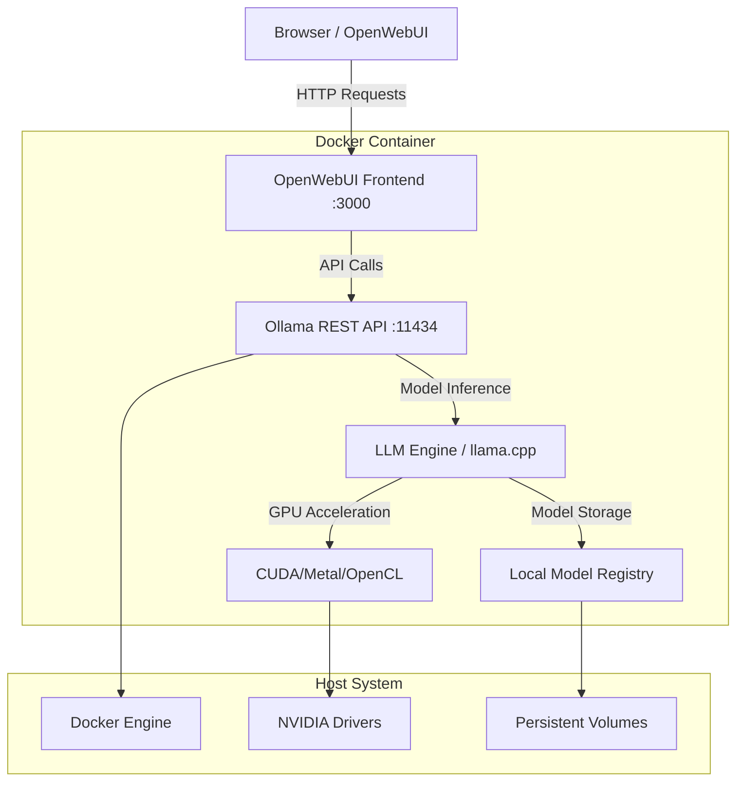

# Build Your Own Chatbot with Docker, Ollama and OpenWebUI

> Zero setup. Run LLMs locally with a browser UI. CPU or GPU. No environment chaos.

---

## 🧠 Core Idea: Local LLMs Should Be Easy

If you're experimenting with LLMs, building prototypes, or running private workloads, installing model runtimes locally can get messy fast. Different libraries, conflicting versions, dependencies that explode your OS — we’ve all been there.

This project solves that pain.

We package **Ollama (LLM runtime)** + **OpenWebUI (browser-based interface)** into a single Docker image.

You don’t install anything except Docker.

When the container runs:

* Ollama starts in the background (serving models via REST API at port `11434`)
* OpenWebUI launches a clean chat interface at `http://localhost:3000`

---

### What is Ollama?

**Ollama** is a lightweight, extensible framework for building and running large language models (LLMs) locally. Think of it as the "Docker for AI models" - it makes running sophisticated language models as simple as pulling and running a container.

**Key Features:**
- **Local Execution**: Run models entirely on your machine without internet dependency
- **Multi-Model Support**: Supports LLaMA, Mistral, Phi, CodeLlama, and many other popular models
- **Efficient Resource Management**: Optimized for both CPU and GPU execution
- **REST API**: Provides a clean HTTP API for model interactions
- **Model Quantization**: Automatically handles model optimization for different hardware

**How Ollama Works:**
1. **Model Storage**: Models are stored in a local registry (similar to Docker images)
2. **Runtime Engine**: Provides an optimized inference engine built on llama.cpp
3. **API Server**: Exposes models through RESTful endpoints
4. **Resource Management**: Automatically manages GPU memory and CPU threading

### What is OpenWebUI?

**OpenWebUI** (formerly Ollama WebUI) is a feature-rich, self-hosted web interface designed to operate entirely offline with Ollama. It provides a ChatGPT-like experience for local language models.

**Key Features:**
- **Intuitive Interface**: Clean, modern chat interface similar to ChatGPT
- **Multi-Model Support**: Switch between different models in the same conversation
- **Conversation Management**: Save, organize, and search through chat history
- **User Management**: Multi-user support with authentication
- **Customizable**: Themes, settings, and model parameters
- **Import/Export**: Backup and restore conversations and settings
- **Real-time Streaming**: Live response streaming for better user experience

**Architecture Benefits:**
- **Privacy First**: All data stays on your machine
- **Offline Capable**: Works without internet connection
- **Extensible**: Plugin system for additional functionality
- **Cross-Platform**: Runs anywhere Docker is supported

### Understanding Language Models

**Large Language Models (LLMs)** are neural networks trained on vast amounts of text data to understand and generate human-like text. Popular models include:

- **LLaMA (Large Language Model Meta AI)**: Meta's efficient language model family
- **Mistral**: High-performance models optimized for efficiency
- **Phi**: Microsoft's small language models with strong reasoning capabilities
- **CodeLlama**: Specialized for code generation and programming tasks
- **Qwen**: Alibaba's multilingual language model series

**Model Sizes and Performance:**
- **1.5B-7B parameters**: Fast inference, good for simple tasks, lower resource usage
- **8B-13B parameters**: Balanced performance and resource usage
- **30B+ parameters**: High-quality responses, requires more powerful hardware

---

## 🧱 Architecture Overview



### Component Breakdown

**OpenWebUI Frontend (Port 3000)**
- React-based web application
- Handles user authentication and session management
- Provides chat interface and conversation history
- Manages UI state and real-time streaming

**Ollama REST API (Port 11434)**
- HTTP server built on Go
- Handles model lifecycle (pull, load, unload)
- Provides endpoints for text generation and embedding
- Manages concurrent requests and resource allocation

**LLM Inference Engine**
- Built on llama.cpp for optimal performance
- Supports CPU (AVX2, AVX-512) and GPU acceleration
- Handles model quantization and memory management
- Implements efficient attention mechanisms and KV-cache

**Hardware Acceleration**
- **CUDA**: NVIDIA GPU acceleration (RTX, A100, etc.)
- **Metal**: Apple Silicon GPU acceleration (M1, M2, M3)
- **OpenCL**: Cross-platform GPU acceleration
- **CPU**: Multi-threaded execution with BLAS optimization

**Data Flow:**
1. User sends message through OpenWebUI
2. Frontend makes HTTP request to Ollama API
3. Ollama loads model (if not already loaded)
4. Inference engine processes request with hardware acceleration
5. Response streams back through the chain to user

---

## 🛠 Prerequisites

* Docker installed
* (optional) NVIDIA GPU + NVIDIA container toolkit

Verify NVIDIA toolkit:

```
docker run --rm --gpus all nvidia/cuda:12.2.0-base nvidia-smi
```

If you see GPU details → you're good.

---

## 🧩 Docker Compose Configuration

This project uses `docker-compose.yml` to orchestrate Ollama and OpenWebUI services.

**GPU Support:** The compose file includes a commented-out GPU configuration section for the Ollama service. To enable GPU acceleration, uncomment the `deploy` section in `docker-compose.yml`:

```yaml
deploy:
  resources:
    reservations:
      devices:
        - driver: nvidia
          count: all
          capabilities: [gpu]
```

---

## 🚀 Run the Workspace

### CPU

```
docker-compose up -d
```

### GPU (CUDA)

1. Uncomment the GPU configuration in `docker-compose.yml` (see Docker Compose Configuration section above)
2. Run:

```
docker-compose up -d
```

> **Note:** GPU support requires NVIDIA Container Toolkit installed on your host machine.

---

## 📥 Model Management Deep Dive

### Understanding Model Operations

Ollama provides comprehensive model lifecycle management through simple CLI commands. Here's everything you need to know about managing your AI models:

### Pulling Models

**What is Model Pulling?**
Model pulling downloads pre-trained language models from Ollama's registry to your local machine. These models are optimized and quantized for efficient local execution.

**Popular Models to Try:**

| Model | Size | Use Case | Memory Req |
|-------|------|----------|------------|
| `qwen2.5:1.5b` | 1.5B params | Lightweight, fast responses | ~2GB RAM |
| `phi3:4b` | 4B params | Balanced performance | ~4GB RAM |
| `mistral:7b` | 7B params | High quality, versatile | ~8GB RAM |
| `llama3:8b` | 8B params | General purpose, reliable | ~10GB RAM |
| `codellama:7b` | 7B params | Code generation & debugging | ~8GB RAM |
| `llama3:70b` | 70B params | Highest quality (GPU recommended) | ~40GB RAM |

**Pull Commands:**
```bash
# Pull a specific model
docker exec -it ollama ollama pull qwen2.5:1.5b

# Pull latest version (default tag)
docker exec -it ollama ollama pull mistral

# Pull specific quantization
docker exec -it ollama ollama pull llama3:8b-q4_0
```

### Model Quantization Explained

**Quantization** reduces model size and memory usage while maintaining acceptable performance:

- `q4_0`: 4-bit quantization (smallest, fastest)
- `q5_0`: 5-bit quantization (balanced)
- `q8_0`: 8-bit quantization (higher quality)
- `f16`: Full 16-bit precision (largest, highest quality)

### Listing Available Models

```bash
# List all locally available models
docker exec -it ollama ollama list
```

**Sample Output:**
```
NAME                 ID           SIZE     MODIFIED
qwen2.5:1.5b        a5f4e4f7b5e  950 MB   2 hours ago
mistral:7b          b5f4e4f7b5e  4.1 GB   1 day ago
llama3:8b           c5f4e4f7b5e  4.7 GB   3 days ago
```

### Deleting Models

**Why Delete Models?**
- Free up disk space (models can be several GB each)
- Remove unused or outdated models
- Clean up after testing different model variants

```bash
# Delete a specific model
docker exec -it ollama ollama rm qwen2.5:1.5b

# Delete multiple models
docker exec -it ollama ollama rm mistral:7b llama3:8b

# Confirm deletion (interactive)
docker exec -it ollama ollama rm --help
```

### Model Information & Details

```bash
# Get detailed model information
docker exec -it ollama ollama show qwen2.5:1.5b

# View model architecture and parameters
docker exec -it ollama ollama show llama3:8b --verbose
```

### Advanced Model Operations

**Creating Custom Models:**
```bash
# Create a model from a Modelfile
docker exec -it ollama ollama create mymodel -f ./Modelfile

# Copy and modify existing model
docker exec -it ollama ollama copy llama3:8b my-custom-llama
```

**Model Updates:**
```bash
# Update to latest version
docker exec -it ollama ollama pull mistral:latest

# Check for updates (compare local vs remote)
docker exec -it ollama ollama list
```

**Storage Management:**
- Models are stored in `/root/.ollama/models` inside the container
- Use Docker volumes to persist models across container restarts
- Monitor disk usage with `docker system df`

**Best Practices:**
1. **Start Small**: Begin with 1.5B-7B parameter models
2. **Monitor Resources**: Check RAM/GPU usage before pulling large models
3. **Regular Cleanup**: Remove unused models to free space
4. **Version Control**: Keep track of which model versions work best for your use cases

---

## 🧪 Test with API
Import bruno folder to bruno api client or use below curl command
```
curl http://localhost:11434/api/generate -d '{"model": "qwen2.5:1.5b", "prompt": "Hello"}'
```
---

## 🌐 Access the UI

Open:
[http://localhost:3000](http://localhost:3000)


You now have ChatGPT‑style interaction **locally**, private, and under your control.

---

## 🔧 Troubleshooting & Performance Tips

### Common Issues & Solutions

**Model Loading Errors:**
```bash
# Check available memory
docker exec -it ollama free -h

# Monitor model loading
docker exec -it ollama ollama ps

# Check logs for errors
docker logs ollama
```

**Performance Optimization:**

**CPU Optimization:**
- Use models appropriate for your RAM (see model table above)
- Enable CPU-specific optimizations by setting `OLLAMA_NUM_PARALLEL=4`
- Consider `q4_0` quantization for faster inference

**GPU Optimization:**
```bash
# Monitor GPU usage
docker exec -it ollama nvidia-smi

# Set GPU memory fraction
docker exec -it ollama ollama serve --gpu-memory-fraction 0.8
```

**Memory Management:**
- Models auto-unload after 5 minutes of inactivity
- Force unload: `docker exec -it ollama ollama stop <model>`
- Check model memory usage: `docker exec -it ollama ollama ps`

---

## 🧾 Final Thoughts

Running LLMs shouldn't be painful. Everyone should be able to:

- **experiment locally** without complex setups,
- **stay private** with full data control,
- **avoid dependency chaos** through containerization,
- **scale efficiently** from laptop to production.

Docker + Ollama + OpenWebUI makes that possible.

If this saved you time — star the repo. ⭐

---

## License

This project is licensed under the License — the same permissive license used by Ollama and OpenWebUI.
